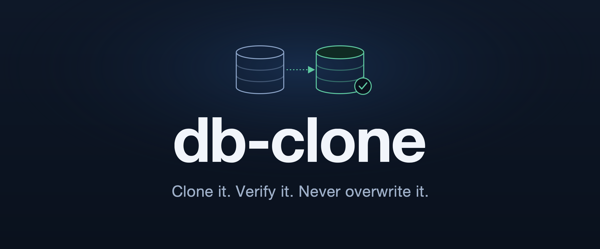

> 🎬 **[Watch the walkthrough — The DB-Clone Protocol](./The_DB-Clone_Protocol.mp4)** — a short tour of the skill.

<!-- TODO(native player): replace the link above with the GitHub-generated user-attachments URL.
     Drag The_DB-Clone_Protocol.mp4 into a new issue/comment on github.com, copy the
     https://github.com/user-attachments/assets/... URL, and paste it on its own line here. -->


# db-clone

> Clone a database — schema **and** data — into a brand-new one, then *prove* the copy is identical. It never overwrites anything that already exists.

## Why

"Just make a copy first." Before every risky migration, backfill, or hand-off, that's the move. So you `pg_dump | psql` and hope — but did the dump finish, or die halfway and leave a database that *looks* fine? Did the target name already exist? Are the row counts even the same? Verifying it properly is tedious, so nobody does.

A backup you didn't verify is a guess. `db-clone` turns the guess into a guarantee: it refuses to overwrite, clones with each engine's native method, and **verifies the result against the source** — integrity, schema, constraints, row counts — reporting `PASS`/`FAIL` for each. If anything's off, it says so and never claims success.

## Today vs. with `/db-clone`

Doing it *correctly* by hand is a checklist you have to remember and execute perfectly, under pressure, every time:

```bash
psql "$MAINT" -tAc "SELECT 1 FROM pg_database WHERE datname='app_clone'"  # check it doesn't exist — and actually bail if it does
psql "$MAINT" -c 'CREATE DATABASE "app_clone";'
pg_dump --no-owner --no-privileges "$SOURCE" | psql "$TARGET" -v ON_ERROR_STOP=1   # forget ON_ERROR_STOP and a failed restore looks like success
# restore died halfway? clean up the half-built db yourself.
# then verify: compare schema, every constraint, row counts for EVERY table... (the step everyone skips)
```

Each line is a place to be silently wrong. Do this instead:

```bash
bash adapters/postgres.sh "$SOURCE" "$TARGET"   # guards + clone + full verification, exits non-zero on any failure
```

## Get started

**1. Clone this repo.**

```bash
git clone https://github.com/yeahitsmejayyy/db-clone.git && cd db-clone
```

**2. Install it as a skill.** Tell your agent: **"Read INSTALL.md and install this skill."** It copies the folder to where your harness looks for skills and makes the adapters executable. (Manual steps and project-vs-global scope: [`INSTALL.md`](./INSTALL.md).)

**3. Run it.**

```
/db-clone
```

Your agent asks which engine, then for the source and a **new** target, restates the plan, clones, and verifies. Or call an adapter directly:

```bash
# SQLite — file to a new file
bash adapters/sqlite.sh ./app.db ./app-clone.db

# PostgreSQL — db to a new db name (same server or another host)
bash adapters/postgres.sh \
  "postgresql://me@localhost:5432/app" \
  "postgresql://me@localhost:5432/app_staging"
```

Either way you get a verdict you can trust:

```
Verifying clone...
  PASS  integrity_check
  PASS  schema match
  PASS  data dump match
  PASS  rows: users
  PASS  rows: orders

RESULT: ✅ clone verified identical to source
  source: ./app.db
  target: ./app-clone.db
```

A failed check leaves the target in place for inspection and ends with `❌` — never a false "done."

## Supported engines

| Engine     | Source               | Target                    | Adapter                |
|------------|----------------------|---------------------------|------------------------|
| SQLite     | path to a `.db` file | path to a **new** file    | `adapters/sqlite.sh`   |
| PostgreSQL | connection URI       | URI with a **new** db name| `adapters/postgres.sh` |

**Prerequisites** (only for the engine you use): SQLite needs the `sqlite3` CLI; PostgreSQL needs `psql` + `pg_dump` (`brew install postgresql@16`). The skill checks for these up front and won't fail silently.

## Guarantees & limits

- **Never overwrites.** An existing target is a hard stop, before any work happens.
- **Verified, not assumed.** Every clone is checked against its source.
- **Self-cleaning (Postgres).** A restore that dies partway drops the half-built db automatically.
- **Schema + data, not access control (by design).** A clone reproduces the database *artifact* — structure and rows — not ownership, roles, or `GRANT`s. You get a clean database to point your migrations, IaC, or DBA at for access control, exactly like any fresh environment. (In Postgres, roles are cluster-level objects that live outside any single database, so a single-db clone is portable across servers and roles by default.)

## Add another engine

Adding MySQL, Mongo, etc. is a drop-in — one new file, one branch. Every adapter takes two args (`SOURCE`, `TARGET`) and honors the same contract:

1. **Preflight** — the engine's CLI tools are on `PATH`, or `die`.
2. **Guard source** — it exists / is reachable.
3. **Guard target** — it does **NOT** exist (cloning only ever creates).
4. **Clone** — the engine's native copy method.
5. **Verify** — `check LABEL EXPECTED ACTUAL` per dimension, then `finish SOURCE TARGET`.

`lib/common.sh` gives every adapter the shared helpers so they all behave identically:

```bash
check "label" "$expected" "$actual"   # records a PASS/FAIL line
finish "$SOURCE" "$TARGET"            # prints the verdict, exits 0 (all pass) / 1 (any fail)
die "message"                         # fatal error before any clone work
sha                                   # hash stdin → digest (for fingerprints)
```

Copy an existing adapter as your skeleton, then wire it into [`SKILL.md`](./SKILL.md): add a table row, a detection hint in step 1, and the run command in step 4. The contract is shared, so a new adapter inherits never-overwrite, verification, and honest failure for free.

## What's in the folder

```
db-clone/
├── SKILL.md            # the dispatcher: engine routing + the procedure your agent follows
├── adapters/
│   ├── sqlite.sh       # SQLite:  clone + verify + guard
│   └── postgres.sh     # Postgres: clone + verify + guard
├── lib/common.sh       # shared PASS/FAIL + verdict helpers
├── INSTALL.md          # how to install it as a skill
└── README.md           # you are here
```
